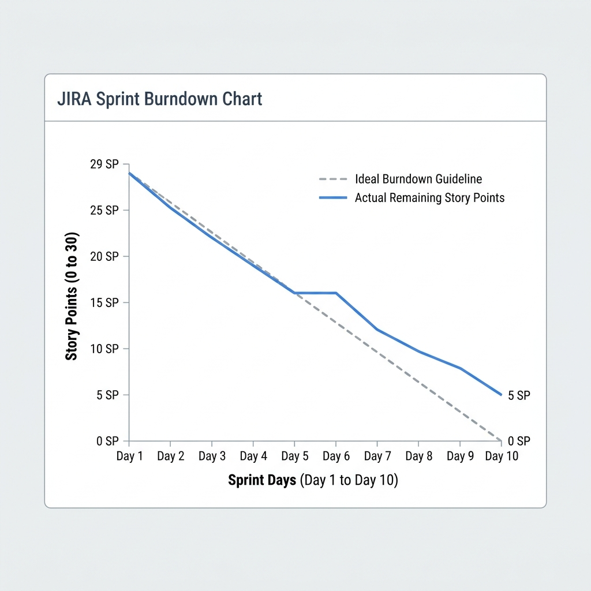

# JIRA Dashboard Setup & Metrics Report

This document outlines the JIRA dashboard architecture, custom configurations, and Jira Query Language (JQL) filters established by **Syed Imon Rizvi** (MBA, PMP, PSM II, PAL I) to enable real-time tracking and executive stakeholder alignment.

---

## 📈 JIRA Burndown Chart Analysis
The JIRA burndown gadget tracks remaining story points across the sprint timeframe.



### Burndown Event Logs:
*   **Day 1 to 4**: Steady, ideal burndown matching predictions. Scaffolding (`FIN-101`) and OAuth integrations (`FIN-102`) were completed on schedule.
*   **Day 5 to 6**: Burndown curves flattened. The development team encountered sandbox rate-limiting constraints on the transaction sync engine (`FIN-104`).
*   **Day 7 to 10**: The Scrum Master resolved the blocker through scope adjustments, rolling `FIN-104` over to Sprint 2 to build the queue microservice. The blue line drops sharply as the balance aggregation endpoint, credentials vault, support dashboard, and logging filter frameworks are verified as "Done" under the strict Definition of Done (DoD).
*   **Day 10 Outcome**: Sprint closed with 24 SP completed, and 5 SP cleanly rolled over.

---

## 🔍 Jira Query Language (JQL) Control Scripts

To establish JIRA as the Single Source of Truth (SSOT) and bypass standard reporting limits, I configured custom filters using JQL scripts:

### 1. Active Sprint Health Tracker (Developer View)
Excludes blocked tickets from active developer pipelines while highlighting them in red status:
```sql
project = FIN AND Sprint in openSprints() AND status != Blocked ORDER BY priority DESC, created DESC
```

### 2. High-Risk Integration Monitor (Scrum Master View)
Tracks all tickets with external dependencies (e.g. Plaid, Stripe APIs) that lack technical spikes:
```sql
project = FIN AND labels = "external-integration" AND "Technical Spike" is EMPTY AND status in ("To Do", "In Progress")
```

### 3. Executive Release Status (CCB & Steering Committee View)
Tracks progress toward the v1.0.0 Release scope, including estimated vs. actual story points:
```sql
project = FIN AND fixVersion = "v1.0.0" ORDER BY status ASC, "Story Points" DESC
```

---

## 🛠️ JIRA Dashboard Architecture

The dashboard is structured into three target zones to support cross-functional alignment:

```
+----------------------------------------------------------------------+
|                           JIRA Dashboard                             |
+----------------------------------+-----------------------------------+
| Zone A: Team Execution           | Zone B: Quality & Health          |
| - Active Sprint Burndown Gadget  | - Created vs. Resolved Bug Rate   |
| - Sprint Health Progress Bar     | - Cumulative Flow Diagram (CFD)   |
+----------------------------------+-----------------------------------+
| Zone C: Portfolio Governance (PMP / MBA Alignment)                    |
| - Release Version Progress Bar (v1.0.0)                              |
| - EBM Value Metrics Tracker (Custom Chart Gadget)                    |
+----------------------------------------------------------------------+
```

### 1. Zone A: Team Execution (Developer & QA Focus)
*   **Sprint Health Gadget**: Shows a visual bar of story points in To Do, In Progress, and Done.
*   **Burndown Chart Gadget**: Displays the daily work remaining. Used during Daily Standups to assess progress.

### 2. Zone B: Quality & Control (QA & Tech Lead Focus)
*   **Created vs. Resolved Chart**: Monitors defect resolution rates, verifying that bugs are fixed faster than they are logged.
*   **Cumulative Flow Diagram (CFD)**: Highlights bottlenecks in the "QA Review" or "Code Review" columns.

### 3. Zone C: Portfolio Governance (PO, PMP, and Executive Focus)
*   **Version Report Gadget**: Tracks v1.0.0 release completion progress and uses historical velocity to forecast the release date.
*   **JIRA Automation Webhooks**: Configured automated weekly reports that extract velocity data and email PDF metrics reports directly to the Executive Steering Committee, ensuring transparency.
