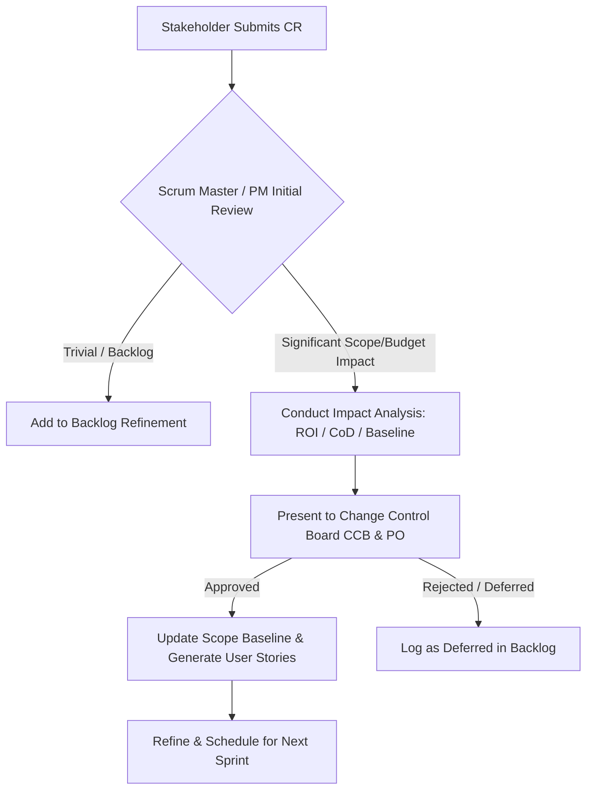

# FinConnect API Integrations - Change Request Log & Hybrid Governance

This document outlines the formal scope governance framework applied to the **FinConnect API Integrations** project. In a hybrid Agile-PMP environment, we balance Agile responsiveness with PMP baseline control and MBA economic analysis.

---

## ⚙️ Hybrid Change Control & Governance Flow

Our governance model integrates the flexibility of Scrum with PMI-aligned project control:

1.  **Request Submission**: All requests are logged with business justifications.
2.  **Impact Analysis**: The Scrum Master/PM (**Syed Imon Rizvi**) evaluates the proposal against the project's Triple Constraints (Scope, Schedule, and Cost) and calculates the **Cost of Delay (CoD)**.
3.  **Governance Routing**:
    *   *Minor changes* are routed directly to the Product Owner for backlog prioritization.
    *   *Major baseline variations* (impacting budget or key release milestones) are routed to the **Change Control Board (CCB)** for formal PMP alignment.
4.  **Sprint Integrity Safeguard (PSM II)**: Approved changes are queued in the Product Backlog for grooming. They are **never** injected into the active sprint, preventing team distraction and preserving committed velocity.

---

## 📁 Change Request Log & Impact Register

| CR ID | Title | Requester | Impact Level | Cost of Delay (CoD) | CCB Status | Scheduled Sprint |
| :--- | :--- | :--- | :---: | :--- | :---: | :---: |
| **CR-2026-001** | Webhook Integration for Real-Time Sync | Product Owner | Medium | **High ($8,500/week)**: Due to delayed fraud-alert product launch. | **Approved** | Sprint 2 |
| **CR-2026-002** | Institutional Multi-Factor Auth (MFA) UI | Security Lead | High | **Critical ($15,000/week)**: Blocks compliance with EU banking standard. | **Approved (Fast-tracked)** | Sprint 2 (Spike) |
| **CR-2026-003** | Dark Mode Theme for Dev Dashboard | Support Lead | Low | **Negligible ($0/week)**: Visual preference. | **Deferred** | Backlog |

---

## 🔍 Detailed Change Evaluations & Business Cases

### CR-2026-001: Webhook Integration for Real-Time Sync

*   **Description**: Implement webhook endpoints to receive transaction signals from Plaid/Stripe in real-time, moving away from simple polling.
*   **Business Case & ROI (MBA)**: Enables real-time consumer notifications, which is a key driver for the "FinAlerts" premium subscription tier. Anticipated subscription uptake: +12% in the first quarter post-launch, yielding an estimated ROI of 145% over 12 months.
*   **Impact Assessment**:
    *   **Scope Baseline**: Expanded to include a public-facing secure HTTPS gateway and event parsing mechanisms.
    *   **Schedule Baseline**: Sprint 1 commitments are preserved. Sized at 8 SP (added to backlog as `FIN-108`). Scheduled for Sprint 2, keeping the final July 10 release milestone intact by utilizing Sprint 3 buffer allocations.
    *   **Cost/Budget**: Utilizes existing developer allocations; no external contractor cost.
*   **Cost of Delay (CoD)**: Delaying this feature past the July 10 release incurs an estimated **$8,500 per week** in lost customer acquisition opportunities.
*   **CCB Decision**: **Approved** on 2026-06-08.

---

### CR-2026-002: Institutional Multi-Factor Auth (MFA) UI

*   **Description**: Add automated support for bank MFA redirect screens (SMS, authenticator tokens).
*   **Business Case & ROI (MBA)**: Risk management requirement. Under regional security standards, failing to support MFA restricts integration with major banks, rendering our balance aggregator useless for 40% of our target market.
*   **Impact Assessment**:
    *   **Scope Baseline**: High. Requires modifying core connection state machines.
    *   **Schedule Baseline**: Pushes Sprint 2 capacity to its limit. Requires a 3 SP Spike story to be executed in Sprint 2 before full implementation. 
    *   **Cost/Budget**: Requires adding one external security consultant allocation for 2 weeks ($4,000 budget impact).
*   **Cost of Delay (CoD)**: Estimated at **$15,000 per week** due to non-compliance risks and blocking the marketing rollout.
*   **CCB Decision**: **Approved** by the CCB and executive sponsors on 2026-06-12. Project budget adjusted by +$4,000.

---

### CR-2026-003: Dark Mode Theme for Dev Dashboard

*   **Description**: Switchable CSS theme for the Developer dashboard.
*   **Business Case & ROI (MBA)**: Minimal economic return. Does not drive client retention or revenue generation.
*   **Impact Assessment**: Negligible. Sized at 2 SP. No budget or timeline impact.
*   **Cost of Delay (CoD)**: **$0 per week**.
*   **CCB Decision**: **Deferred** to product backlog by the Product Owner and Scrum Master. To be prioritized in future maintenance releases if bandwidth permits.
