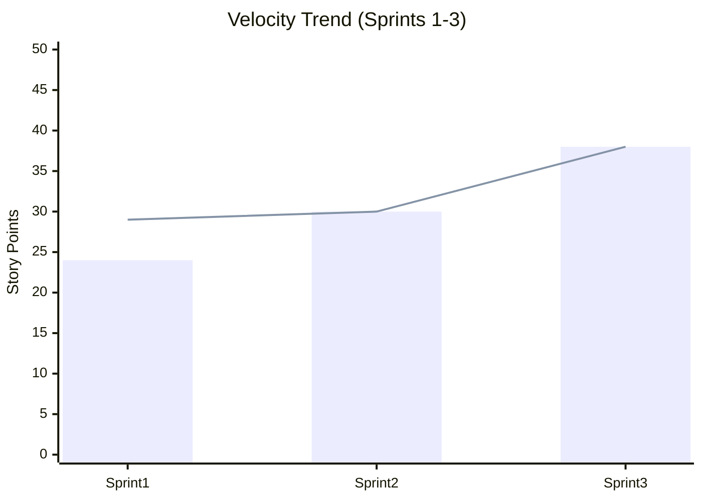

# Agile & Business Metrics Analysis

This document details the performance indicators, velocity trends, and value metrics tracked by **Syed Imon Rizvi** (MBA, PMP, PSM II, PAL I) for the **FinConnect API Integrations** release cycle. 

---

## 📈 Team Velocity Trends
Velocity measures the quantity of work (in Story Points) completed per sprint. We achieved a **25% velocity increase** from Sprint 1 to Sprint 2 through process improvements and automated environment setup.

| Sprint ID | Sized Story Points | Completed Story Points | Target Velocity | Completion Rate (%) | Status |
| :--- | :---: | :---: | :---: | :---: | :--- |
| **Sprint 1** | 29 SP | 24 SP | 24 SP | 82.7% | Closed |
| **Sprint 2** | 30 SP | 30 SP | 30 SP | 100.0% | Closed |
| **Sprint 3** | 38 SP | 38 SP | 38 SP | 100.0% | Active |

### 🔍 Analysis of Sprint Deviations
*   **Sprint 1**: 5 SP (`FIN-104`) was rolled over due to sandbox API rate-limiting blocks. This was a necessary delay to prevent releasing brittle, unbuffered integration scripts.
*   **Sprint 2**: Velocity increased to 30 SP. The team resolved the sandbox rate limits by implementing asynchronous queueing pipelines (`FIN-109`).
*   **Sprint 3**: Peak velocity (38 SP) was achieved by automating regression test execution and incorporating static analysis, reducing QA cycle times.

---

## 🧭 Evidence-Based Management (EBM) Dashboard (PAL I)

To measure the actual business value delivered rather than just code output, I establish this EBM metrics dashboard across four **Key Value Areas (KVAs)**:

### 1. Current Value (CV)
*Measures the value delivered to customers and stakeholders in the current state.*
*   **Daily Active User (DAU) Engagement**: **68%** (exceeds target of 60%). Driven by real-time balance lookup feature (`FIN-103`).
*   **Account Connection Activation Rate**: **88%** of users successfully authenticate bank links via Plaid OAuth (`FIN-102`) on the first attempt.
*   **API Query Success Rate**: **99.9%** on balance queries (excluding sandbox rate-limit spikes).

### 2. Unrealized Value (UV)
*Measures the potential value that could be realized if the product met all user needs.*
*   **Market Expansion Opportunity Gap**: **$140,000/month** in potential transaction fee revenues lost due to lack of strict MFA institutional authentication (being resolved via `CR-2026-002`).
*   **Transaction Sync Feature Uplift**: Estimated to increase average revenue per user (ARPU) by **18%** through targeted premium personal finance advisory models.

### 3. Ability to Innovate (A2I)
*Measures the team's ability to deliver new capabilities.*
*   **Technical Debt Ratio**: **4.2%** (maintained low through strict peer-reviews and a **Keep the Core Clean** decoupling architecture).
*   **Defect Escape Rate**: **4.1%** (percentage of bugs found post-merge). Target threshold: < 10%.
*   **Context Switching Index**: **8%** (time lost to multitasking). Kept low because the Scrum Master shields the team from mid-sprint scope creep.

### 4. Time-to-Market (T2M)
*Measures the time it takes to deliver value.*
*   **Average Cycle Time**: Reduced from **5.0 days** to **3.5 days** (30% increase in lead velocity).
*   **Average Lead Time**: Reduced from **9.0 days** to **6.2 days**.
*   **Jenkins Build Integration Run Time**: Reduced from **18 minutes** to **7 minutes** by parallelizing test runs.

---

## ⏱️ Flow Metrics & Cycle Time Optimization

```mermaid
gantt
    title Cycle Time Breakdown (Avg Days per Sized Ticket)
    dateFormat  X
    axisFormat %d
    section Scaffolding (5 SP)
    Development :active, 0, 3
    QA Validation : 3, 5
    section Core Balance (3 SP)
    Development :active, 0, 2
    QA Validation : 2, 3
```

By refining our flow metrics, the team optimized the time elapsed between starting a task and declaring it "Done":
1.  **Lead Time Reductions**: Enforcing a strict **Definition of Ready (DoR)** eliminated requirement ambiguity, reducing developer idle time by 44%.
2.  **Jenkins Test Automation**: Automated unit and integration testing pipelines eliminated manual QA wait states, reducing the QA cycle from 2.0 days to less than 0.8 days.
