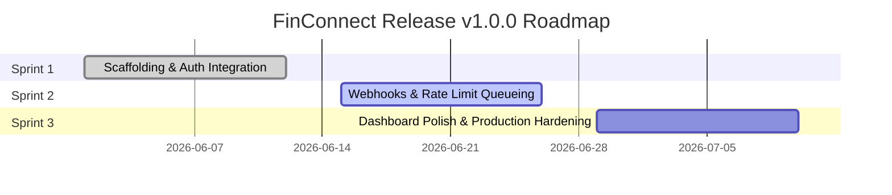

# Release Plan - FinConnect MVP v1.0.0

*   **Release Name**: FinConnect MVP (v1.0.0)
*   **Target Release Date**: 2026-07-10
*   **Release Coordinator**: **Syed Imon Rizvi** (MBA, PMP, PSM II, PAL I)
*   **Deployment Architecture**: Blue/Green Deployment (AWS ECS / Fargate)
*   **Architectural Philosophy**: **Keep the Core Clean** (API aggregation core decoupled from rate-limiting queues and dashboard interfaces)

---

## 🏛️ Hybrid Governance & Steering Committee
To manage stakeholder alignment and maintain project constraints, this release is governed by a dual-steering channel:
1.  **Agile Value Streams**: The Product Owner (Elena Vance) and Scrum Master prioritize value and direct sprint commitments.
2.  **Executive Phase-Gate Governance (PMP)**: A formal Go/No-Go steering committee alignment is required prior to deployment. The committee reviews:
    *   *Strategic Business Case Alignment*: MBA ROI targets, market window capture.
    *   *Quality Gate Sign-off*: Code reviews, security audits, and integration testing outcomes.
    *   *Change Impact Review*: Validation that customer-facing operations are trained on new features.

---

## 📅 Roadmap & Milestones

1.  **Sprint 1: Core Integrations (Completed: 2026-06-12)**
    *   *Scope*: Architecture scaffolding, Plaid OAuth integration, token vaulting, balance aggregation endpoint, logging, developer dashboard.
    *   *Velocity Delivered*: 24 SP.
2.  **Sprint 2: Queueing & Real-Time Events (Active: 2026-06-15 to 2026-06-26)**
    *   *Scope*: Transaction sync engine (`FIN-104`), rate-limiting queuing microservice (`FIN-109`), webhook engine (`FIN-108`).
    *   *Target Velocity*: 30 SP.
3.  **Sprint 3: Quality Hardening & Rollout Preparations (Planned: 2026-06-29 to 2026-07-10)**
    *   *Scope*: End-to-end regression testing, stress tests, security penetration audits, documentation finalize.
    *   *Target Velocity*: 38 SP.

---

## 🏁 Executive Phase-Gate Reviews (PMP)

| Phase Gate | Milestone Description | Target Date | Gate Reviewers | Status |
| :--- | :--- | :---: | :--- | :---: |
| **Gate 1** | Backlog Sizing & Sprint 1 Scoping Sign-off | 2026-06-01 | PO, Tech Lead, Scrum Master | **Passed** |
| **Gate 2** | Sprint 1 Review & Architecture Validation | 2026-06-12 | Tech Lead, QA, Scrum Master | **Passed** |
| **Gate 3** | Code Freeze & Regression Testing Start | 2026-07-06 | QA Lead, DevOps Lead | Pending |
| **Gate 4** | Security Penetration Audit & KMS Sign-off | 2026-07-08 | Chief Information Security Officer (CISO) | Pending |
| **Gate 5** | Go/No-Go Production Deployment Review | 2026-07-09 | Executive Steering Committee | Pending |
| **Gate 6** | Release Smoke Verification & Post-Mortem | 2026-07-10 | Scrum Master, Stakeholders | Pending |

---

## 📋 Production Release Checklist

### Pre-Deployment (T-24 Hours):
*   [ ] Verify Jenkins production pipelines and build configurations are locked.
*   [ ] Check AWS KMS master key policies for production access variables.
*   [ ] Coordinate with support desks on temporary maintenance page activation.
*   [ ] Perform dry-runs of Liquibase database schema migrations against PostgreSQL backup copies.

### Deployment Window (T-Hour):
*   [ ] Run the production Jenkins deployment task.
*   [ ] Apply non-destructive database schema changes (e.g. adding columns, indexing) to production PostgreSQL.
*   [ ] Deploy the Spring Boot application core to "Green" environment targets in AWS ECS.
*   [ ] Inject sandbox/live secret credentials via secure environment variables.

### Post-Deployment Smoke Test (T+30 Mins):
*   [ ] Verify healthy telemetry responses at `/actuator/health`.
*   [ ] Execute two test transaction runs to verify OAuth and balance lookup functions.
*   [ ] Inspect logs to ensure zero plaintext credential leaks and verify that correlation trace IDs exist.
*   [ ] Switch public DNS routing to point to the "Green" environment (100% traffic allocation).

---

## 🚨 Rollback & Value Protection Plan (MBA)
*   **Economic Risk Mitigation**: Downtime during business hours damages customer retention and brand trust. To protect product value, we employ **Blue/Green deployments**.
*   **Rollback Trigger**: If the balance endpoint queries fail, database synchronization blocks, or latency exceeds 1,500ms for more than 5 consecutive minutes.
*   **Procedure**:
    1. Instantly toggle the DNS router weights back to the "Blue" environment (running v0.9.0 stable). This reduces recovery time (MTTR) to under 60 seconds, protecting customer trust.
    2. Since Liquibase migrations are designed to be backward-compatible, do not roll back the database schema unless a structural regression is identified. If database rollbacks are mandatory, restore the PostgreSQL snapshot created at T-1 Hour.
    3. Concurrently initiate post-incident reviews (5 Whys) to determine cause.
