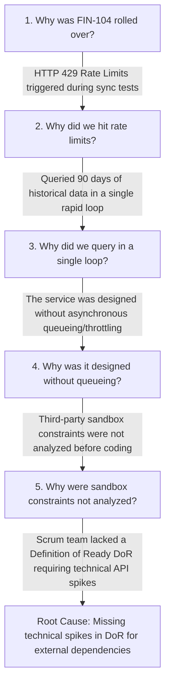

# Sprint 1 Retrospective - FinConnect Core API Integrations

*   **Sprint Cycle**: Sprint 1 (2-Week Cycle)
*   **Date**: 2026-06-12
*   **Facilitator**: **Syed Imon Rizvi** (Scrum Master / Agile Coach)
*   **Attendees**: Elena Vance (PO), David Chen (Tech Lead), Sarah Jenkins (Dev), Marcus Brody (QA)

---

## 📊 Sprint 1 Outcome Summary
*   **Committed Velocity**: 29 Story Points
*   **Delivered Velocity**: 24 Story Points (82.7% Completion Rate)
*   **Rolled Over Story**: **FIN-104** (Transaction History Synchronization Engine - 5 SP)
*   **Actionable Blocker**: Hit HTTP 429 Rate Limit responses from the Plaid sandbox environment during historical database sync queries. Sized a new story **FIN-109** (Rate Limit Queueing & Automated Retry Circuit) to solve this architectural challenge in Sprint 2.

---

## 🔍 Root-Cause Analysis (5 Whys Framework)

To ensure empirical adaptation, I led the team through a **5 Whys Analysis** to understand the root cause of the `FIN-104` rollover:

*   **1. Why was the Transaction Sync Engine (FIN-104) rolled over?**
    *   *Answer*: Because we encountered recurring HTTP 429 (Rate Limit Exceeded) errors in the Plaid sandbox during automated testing.
*   **2. Why did we hit rate limits?**
    *   *Answer*: Because the sync script attempted to pull 90 days of historical transactions in a single, synchronous loop.
*   **3. Why did we query in a single synchronous loop?**
    *   *Answer*: Because the backend service was scaffolded without throttling controls or asynchronous queues.
    *   *Architectural Note*: Directly coupling the core API with external sync tasks goes against the **"Keep the Core Clean"** philosophy.
*   **4. Why was it scaffolded without queuing or rate-limiting mechanics?**
    *   *Answer*: Because the technical limitations of Plaid sandbox environments were not analyzed during backlog grooming.
*   **5. Why were environment constraints not analyzed beforehand?**
    *   *Answer*: Because our **Definition of Ready (DoR)** did not mandate a technical research spike for external integrations.
*   **Root Cause**: Lack of a formal DoR requirement for technical spikes on third-party APIs. We will resolve this by updating the DoR guidelines for Sprint 2.

---

## 🧠 Team Psychological Safety Assessment

A high-performing team requires a safe culture. I conducted an anonymous survey at the end of Sprint 1 to evaluate team dynamics:
*   **Psychological Safety Score**: **4.8 / 5.0**
*   **Key Feedback**:
    *   *Strengths*: Team members felt highly respected. The SM's decision to coach developers through pairing rather than enforcing timeline pressures was highly appreciated.
    *   *Avenue for Growth*: Developers felt hesitant to immediately raise technical blocks, fearing they might be perceived as underperforming.
    *   *SM Action*: Emphasize Scrum values (Openness & Courage) in next sprint planning. Encourage the team to highlight blocks immediately in the Slack channel.

---

## 🎯 Continuous Improvement Plan (Action Items)

| ID | Action Item Description | Owner | Target Sprint | KVA Impacted (EBM) | Status |
| :--- | :--- | :--- | :---: | :---: | :---: |
| **ACT-1.1** | Add "Technical Spike Completed" to the DoR for all stories containing external integrations. | Syed Imon | Sprint 2 | **Time-to-Market (T2M)** | **In Progress** |
| **ACT-1.2** | Decouple rate-limiting queueing to a separate service, maintaining the **Keep the Core Clean** paradigm (`FIN-109`). | David Chen | Sprint 2 | **Ability to Innovate (A2I)** | **Open** |
| **ACT-1.3** | Set up parallel testing scripts in Jenkins pipeline to reduce code merge wait times. | Marcus Brody | Sprint 2 | **Time-to-Market (T2M)** | **Open** |
| **ACT-1.4** | Move Backlog Refinement to a bi-weekly cadence (Tuesday/Thursday, 30 mins) to prevent meeting fatigue. | Syed Imon | Sprint 2 | **Current Value (CV)** | **In Progress** |
